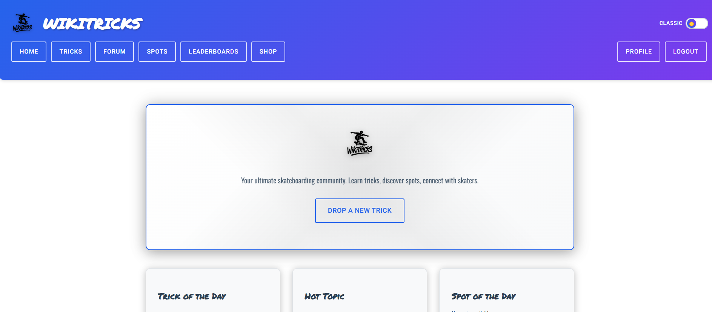
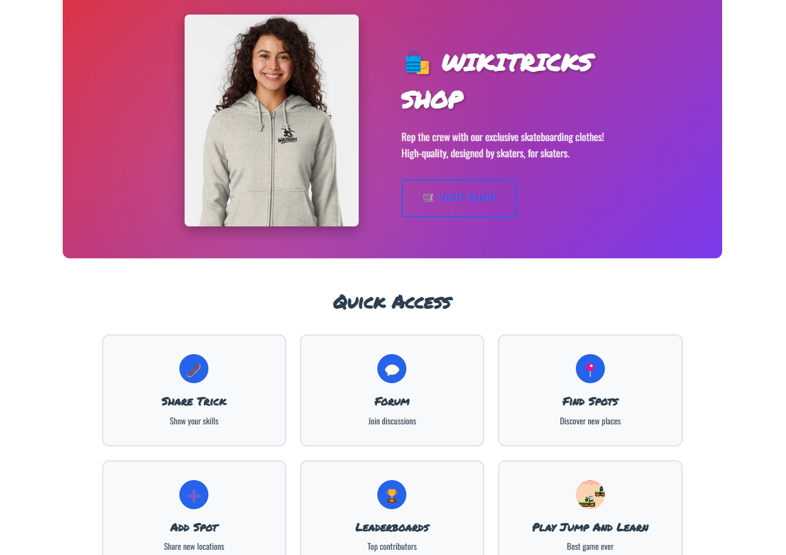
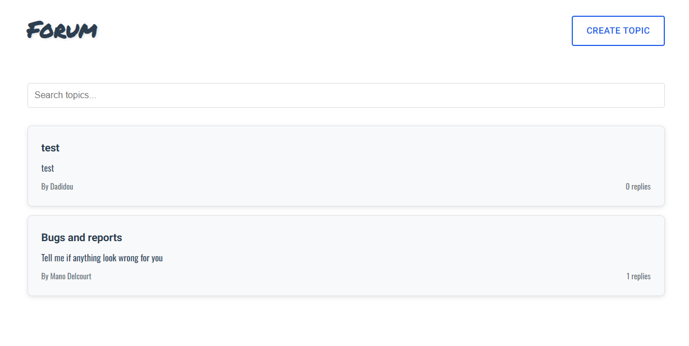
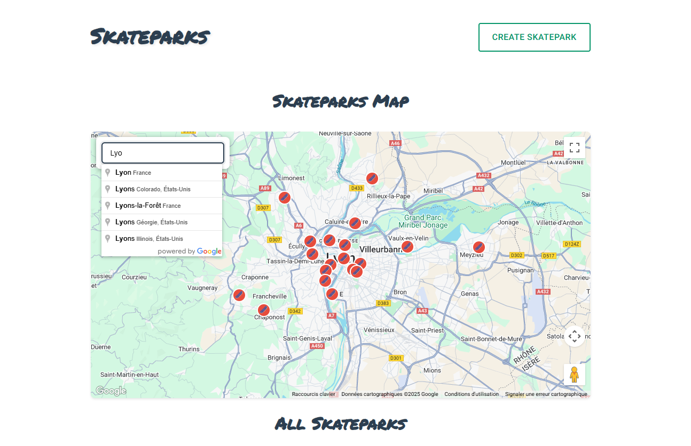
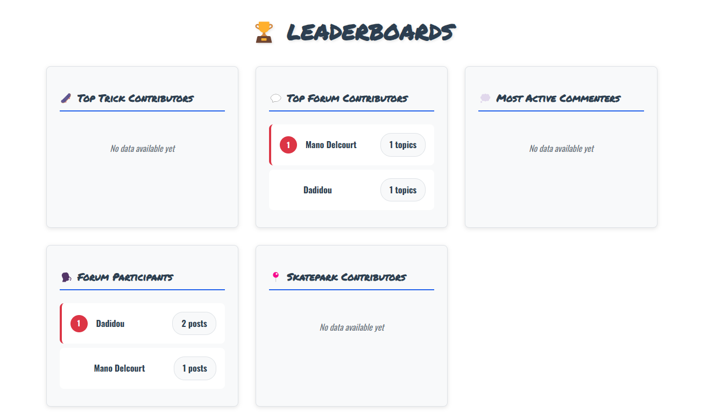
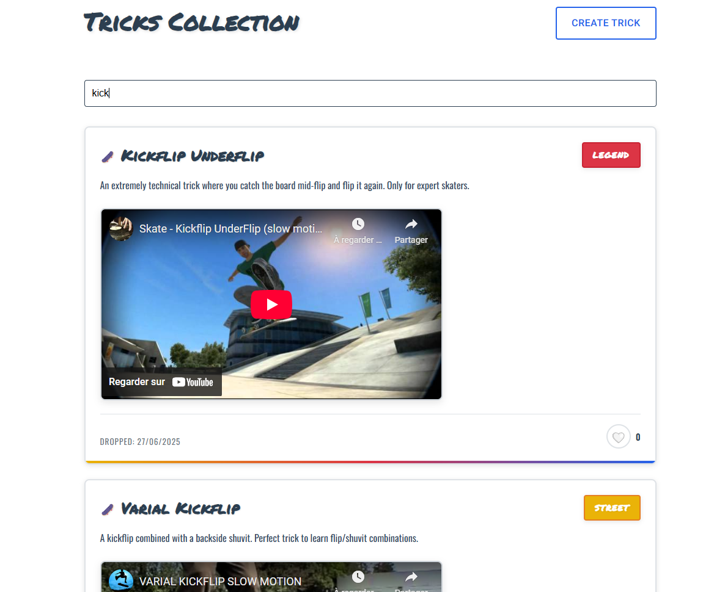
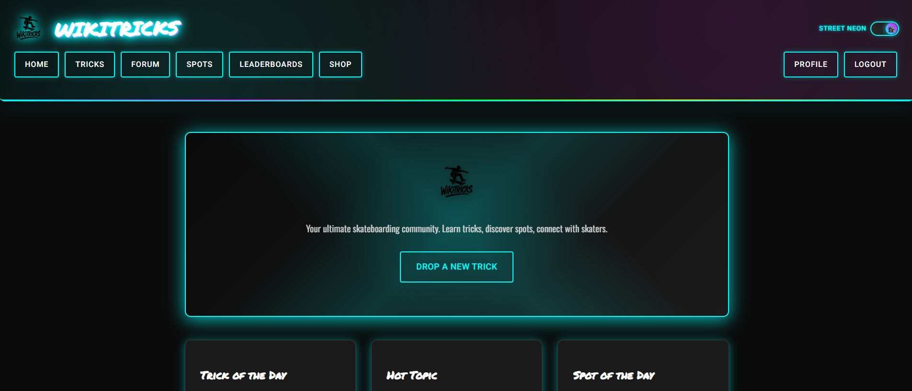

# WikiTricks

WikiTricks is a skateboarding community platform where users can share tricks, find skateparks, join discussions, and contribute to leaderboards. It consists of a **Frontend** built with React and a **Backend** powered by Python.

---

## Table of Contents

- [Features](#features)
- [Installation](#installation)
- [Frontend](#frontend)
  - [Available Scripts](#available-scripts)
- [Backend](#backend)
  - [Environment Variables](#environment-variables)
  - [Database Scripts](#database-scripts)
- [Deployment](#deployment)
- [Contributing](#contributing)
- [Screenshots](#screenshots)
- [License](#license)

---

## Features

WikiTricks offers a variety of features to enhance the skateboarding experience:

- **Trick of the Day**: Highlighted skateboarding tricks to inspire and challenge users.
- **Forum**: A space for skaters to discuss topics, share experiences, and ask questions.
- **Skateparks**: Discover skateboarding spots near you or add new locations to the database.
- **Leaderboards**: Track top contributors and celebrate community achievements.
- **User Profiles**: Manage your account, view your contributions, and customize your profile.
- **Interactive Community**: Connect with other skaters, share knowledge, and grow together.
- **Mobile-Friendly Design**: Optimized for use on both desktop and mobile devices.
- **Admin Dashboard**: Admin users can view platform statistics, recent activity, and manage (delete) tricks, topics, replies, and comments.
- **Comment Moderation**: Admins can delete inappropriate comments directly from the forum or trick pages.
- **Google Authentication**: Users can register and log in using their Google accounts.
- **Profile Security Settings**: Users can update their passwords and manage security settings.
- **Dark Mode**: Enjoy a visually comfortable experience with dark mode support.

---

## Installation

1. Clone the repository:
   ```bash
   git clone https://github.com/yourusername/WikiTricks.git
   cd WikiTricks
   ```

2. Install dependencies for both Frontend and Backend:
   ```bash
   cd Frontend
   npm install
   cd ../Backend
   pip install -r requirements.txt
   ```

---

## Frontend

The Frontend is built with React and styled-components.

### Available Scripts

In the `Frontend` directory, you can run:

- **Start Development Server**:
  ```bash
  npm start
  ```
  Runs the app in development mode at [http://localhost:3000](http://localhost:3000).

- **Run Tests**:
  ```bash
  npm test
  ```
  Launches the test runner in interactive watch mode.

- **Build for Production**:
  ```bash
  npm run build
  ```
  Creates an optimized production build in the `build` folder.


---

## Backend

The Backend is powered by Python and uses Flask for the web framework.

### Environment Variables

Create a `.env` file in the `Backend` directory with the following variables:
```env
DATABASE_URL=your_database_url
SECRET_KEY=your_secret_key
```

### Database Scripts

The `db_scripts` folder contains utilities for managing the database:
- **Backup Database**: `backup_db.py`
- **Clear Database**: `clear_db.py`
- **Initialize Database**: `init_db.py`
- **Populate Tricks**: `populate_tricks.py`

Run scripts using:
```bash
python db_scripts/<script_name>.py
```

---

## Deployment

### Frontend
The Frontend can be deployed using Netlify. Configure `netlify.toml` for deployment settings.

### Backend
The Backend can be deployed on platforms like Heroku or AWS. Ensure environment variables are set correctly.

---

## Contributing

We welcome contributions! Please follow these steps:

1. Fork the repository.
2. Create a new branch:
   ```bash
   git checkout -b feature-name
   ```
3. Commit your changes:
   ```bash
   git commit -m "Add feature description"
   ```
4. Push to your branch:
   ```bash
   git push origin feature-name
   ```
5. Open a pull request.

---

## Screenshots

Here are some screenshots showcasing the functionality of WikiTricks:

- **Home Screen**:
  

- **Alternative Home Screen**:
  

- **Forum Screen**:
  

- **Skateparks Screen**:
  

- **Leaderboards Screen**:
  

- **Tricks Screen**:
  

- **Dark Mode Screen**:
  

---

## Author

Mano.D

---

